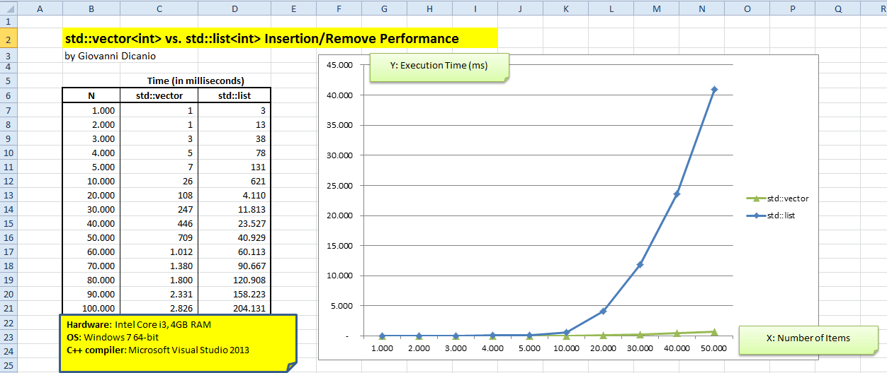

# Insertion/Remove Performance of std::vector vs. std::list #

by Giovanni Dicanio

2014, April 6th

This repository contains a couple of benchmarks, to compare insertion and remove performance for `std::vector` vs. `std::list`, for integer elements.

`std::vector` does **much better** than `std::list`!  
It's **contiguous memory allocation** pattern is _great_ performance-wise, if compared to `std::list` node-based allocation.

  

See the commented C++ sources for details on the benchmarks.

Consider also watching this interesting talk [_"Modern C++: What You Need to Know"_][modern_cpp_build2014] from Build 2014.

**PS**  
I wrote the benchmarks using Notepad2 as editor, and compiled from the command line. For convenience, I then wrapped the code in a VS2013 solution.  
However, it's still possible to compile directly from the command line (see the comments in the source codes for details about that).

[modern_cpp_build2014]: channel9.msdn.com/Events/Build/2014/2-661
